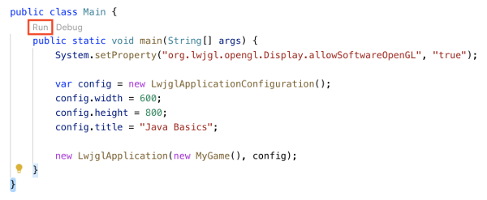

# java-basics

Sandbox project for teaching Java basics.


### Building the code

From the terminal, type:
```bash
./gradlew build
```


### Running the code

From the terminal, run:
```bash
./gradlew run
```


### Importing into VSCode

Select _File_ -> _Open..._ and select the `java-basics` folder. The project should be correctly imported to Visual Studio Code.

To run the game, click on the `src/main/java/app/Main.java` file in the sidebar on the left-hand side and then choose the _Run_ option just above the `main` method:

