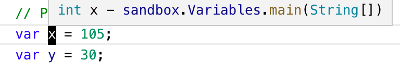

# Lesson 2

Objectives:

  * _Variables_: `var` keyword
  * _Types_: `int` and `String`
  * _Operators_: variable assignment `=`

Extras:

  * Explicit vs implicit types
  * Case-sensitivity in Java


### Declaring Variables

Very often when writing programs we would like to _store_ (or remember) some value for future use. For example, let's say you would like to keep track of the amount of health the player has left. Variables allow us to do just that: you can think of them as a box that can hold something inside. The box is the variable, and the contents are the _value_ of the variable.

Let's look at a simple example:

```Java
all variables must have names
          |
          V
var playerHealth = 100;  <-- remember the semicolon at the end!
 ^                  ^
 |                  |
 |            initial value
 |
declare variables with the var keyword
```

Here, we _declare_ (in other words, create) a variable named `playerHealth` with the _initial value_ of `100`. Let's break down what all that means.

In Java, to use a variable we need to declare it first. Some other languages allow you to use variables without declaring them, but this can lead to _bugs_ (or errors) in your code. To declare a variable in modern Java (version 9 and above, but you don't need to be concerned about this now), we use the `var` keyword.

Next, we have to give the variable a name. Computers don't really care what we name our variables but we should. The name should be something that describes the _purpose_ of the variable so that you (and other programmers) can understand it well when reading the code. In our example, `playerHealth` is a good name, since it tells us exactly what do we intend to use the variable for: storing the player health. On the other hand, naming your variables `a` or `b` usually doesn't tell us anything useful about their purpose.

**Note:** in a `for` loop, naming your loop index `i` is a _convention_ that all programmers understand, so that's an exception. Another one is coordinates: `x` and `y` are just fine. In most cases, however, use a bit longer names.

All variables defined with the `var` keyword **must** have an _initial value_, that is a value that the variable starts out with. In our example above, `playerHealth` will start out with a value of `100`. We will talk how to declare variables without an initial value later, but the best practice is to always give your variables an initial value if possible.

To practice declaring variables, open up the `src/main/java/sandbox/Variables.java` file and put the following code in the `main` method:

```Java
var x = 105;
var y = 30;

System.out.println(x);
System.out.println(y);

var result = 3 * x + 2 * y;

System.out.println(result);
```

You should see the following output when running the program:

```text
105
30
375
```

From our example, you can see that we can _reference_ other variables when declaring a new variable:

```Java
var result = 3 * x + 2 * y;
```

Here, the `result` variable will have different value depending on the values you give to the `x` and `y` variables. Try it out for yourself!


### Basic Types in Java

So far, we've used only numbers. Those numbers are _integers_, which can be positive or negative whole numbers like `0`, `-301`, `58` etc. Integers in Java are represented by an _int_ type. Because we used `var` to declare our variables, we haven't seen it being used yet. Here's some variable declarations from the previous example:

```Java
var x = 105;
var y = 30;
```

If you hover over the `x` or `y` with your mouse cursor in Visual Studio Code, you will see the type of those variables:



Here, the type of both `x` and `y` is `int`, a Java name for an integer. If you wish, you can re-write the above code like this, to see that it's completely equivalent:

```Java
int x = 105;
int y = 30;
```

That was how we had to declare variables before Java 9, by _explicitly_ specifying the variable type. Using the `var` keyword makes the type _implicit_: Java will pick the correct type based on the value that we assign to it. That's why you **must** give the variable an initial value when  using `var`, so that Java knows what type the variable's going to be.

Let's now take a look at another very useful type in Java: `String`. String variables can hold any _text_, for example:

```Java
var playerName = "Mike";
                 ^    ^
                 |    |
  note the double quotes around the text!
```

**Note:** In Java, string values **always** come in double quotes.

Another way of declaring the same variable is of course by typing:

```Java
String playerName = "Mike";
```

Note that you can't do something like this, however:

```Java
String playerName = 10;   // WRONG!
```

If you try, Visual Studio Code will tell you something like that:

```text
Type mismatch: cannot convert from int to String
```

The error message tells you that you can't just put a number into a variable that's meant to hold text. Some languages allow you to do things like that but not Java. It's because Java is _statically typed_. It's a fancy way of saying that variables are always given a type when they are created and you can't assign values of one type to variables of a different type (in general).

Coming back to the box analogy, you can think of the variable's type as the _shape_ of the box. You can put inside it values that are the same shape (have the same type), but you can't put values that have a different shape (have a different type), like `int` and `String`.

In order to see what we can do with `int` and `String` variables, we need to talk about _operators_.


### Basic Operators

Operators in Java are similar to operators in Maths. The basic one we've already used in the code examples is the _assignment operator_: `=`. This operator is used to assign an initial value to a variable, like this:

```Java
var damage = 26;
```

It can also be used, however, to change the value of the variable after it has been created. Let's look at a quick example. Put this code into the `main` method of the `Variables.java` file:

```Java
var playerName = "Katy";

System.out.println(playerName);

playerName = "Josh";

System.out.println(playerName);
```

When you run this code, you will see the following output:

```text
Katy
Josh
```

Note that we have completely replaced the previous value of the `playerName` variable by using the assignment operator. You can't, however, do something like this:

```Java
var playerName = "Katy";
var playerName = "Josh";  // WRONG!
```

If you try to run a code like this, Java will give you an error:

```text
Duplicate local variable playerName
```

It's because you are trying to _declare_ a new variable with the same name as an existing variable and Java doesn't allow that. Note that to assign a new value to an _existing_ variable, we don't put anything before the variable name.

Let's now see what you can do with variables of different types, starting with strings:

```Java
var name = "Kamil";   // Use your own name here
name = "Super " + name;
System.out.println("Hello, " + name);
```

In Java, we can glue two string variables together (or _concatenate_ them, as it's otherwise known) by using the `+` operator. Run this program and see what output it produces.

For integers, we have the basic set of mathematical operations available: addition (`+`), subtraction (`-`), multiplication (`*`) and division (`/`). You've seen some of them used in our examples before.

One final note to remember: Java is a _case-sensitive_ language. This means that to Java, `playerHealth`, `PlayerHealth` and `PLAYERHEALTH` are three **completey different things**. If you declare a variable as for example `x`, then you must always use that name when referring to it. If you try to use `X` instead, Java will complain with an error:

```text
X cannot be resolved to a variable
```

Remember: always use _exactly the same_ name when declaring and using the variables!
